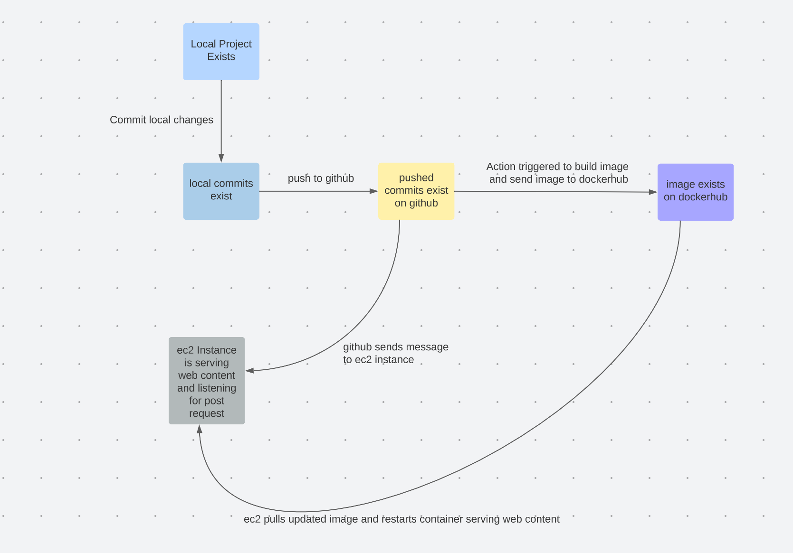

# Project 5 | CD

## Part 1
### Project Overview
- We are adding on to our existing workflow so that new version images pushed to docker hub will automatically be pulled and run on the ec2 instances running our "site". This all happens just from a push to github.
- This is important functionality because if we had many instances serving site content it would take a long time to update them with new site content manually. 
- Tools used: metadata-action@v4 (for semantic versioning), webhook by adnanh

- Workflow diagram

## Semantic versoning
- Added semantic versioning to my workflow (docker_action.yml) so images can be kept track of easier.
- Tools: metadata-action@v4 
- To generate a tag: `git tag v0.2.6`
- To push tag `git push origin v0.2.6`
- On every push with tags starting with v0, v1, v2 three new docker images are pushed to built and pushed to dockerhub (latest, major, minor) 
- [My docker hub](https://hub.docker.com/repository/docker/asotirelis/3120-cicd/general) 

## Part 2 - The CD

Update README-CD.md in main folder of your repo to include:

- Install Docker: `sudo apt install docker.io` 
- Restart Script:
    - Steps
        - stops docker image
        - removes image
        - pulls latest from docker hub
        - runs pulled images
    - I put my script in `/var/scripts/` as the documentation for the webookwhich instructed. You will need to create the scripts folder in var.

- Webhook:
    - intall : `sudo apt-get install webhook`
    - Use `sudo systemctl start webhook.service` you can replace start with stop and restart as needed. We shouldn't need to do this since we used apt-get and it installs as a service.
    - webhook definition:

        - is located at `/etc/webhook.conf`
        - gives id for HTTP GET, POST request to identify what webhook to contact
        - gives location of script to pull new image and run it
        - Sets working directory to: "/var/webhook" which you will have to create because when installing with apt get it does not create it for you.
    - Set up listener on Github
        - go to repo
        - go to settings.
        - go to to webhooks
        - click create webhook
        - use `http:/your-url/hooks/your-id`
        - select desired desired event to run on. I used "workflow runs" and push.

- [Link to my youtube video demo](https://www.youtube.com/watch?v=iXTpvdaJMn8)