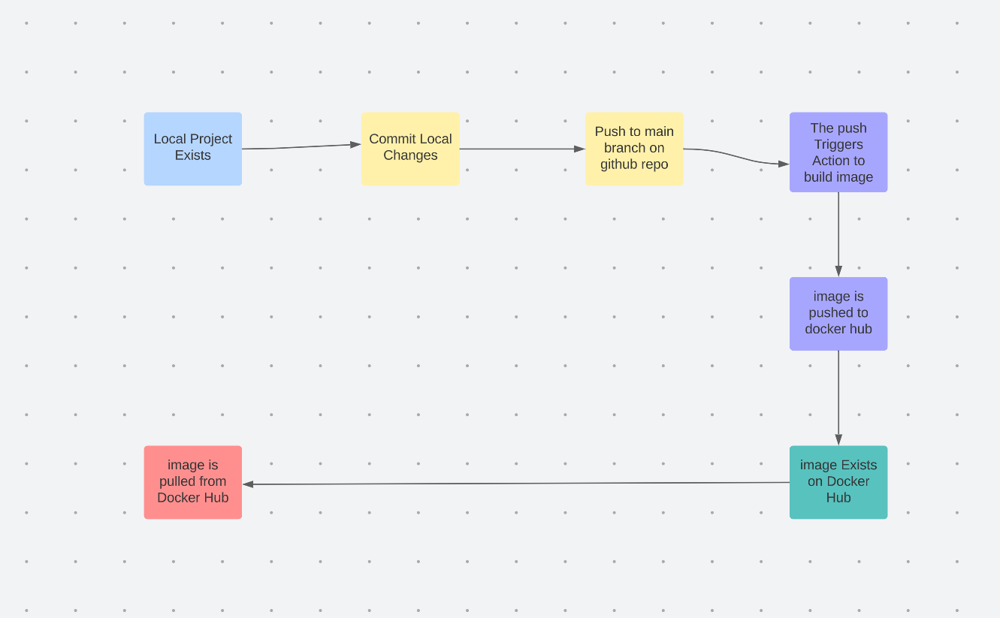

# Project 4: CI: 3120-cicd-asotirelis
## Part 1 
### CI Project Overview
- This project builds a docker image that can run a website. Automated continuous integration features are used so that once a changed is pushed to the main branch of the Github repository an updated docker image is pushed to Docker Hub.
- This automation is useful because it can cut down on simple but repetitive tasks that would take a long time to do at large scale.
- git, Github actions (yml workflow file), Github secrets, docker, Dockerfile, base httpd docker image
- Project Diagram  

### How to Run Project Locally
- Docker Install
- Go to [docker.com](https://www.docker.com) and select the version for the correct operating system and install.
- Build image from Dockerfile: `docker build -t web:0.1 .` where web:0.1 can be replaced with a different name:tag
- how to run the container: `docker run -dit -p 8080:80 web:0.1` 
- how to view the project type `http://localhost:8080` and hit enter
## Part 2
pull image: `docker pull asotirelis/3120-cicd:main` 

- How to create Docker Hub Repo

    - Go to [hub.docker.com](https://hub.docker.com/) and create an account
    - Click `Create Repository` button and give it your repo a name (choose public)
    - For safer authentication create an authentication token: Account Settings > security > New Access Token

- CLI Docker Authentication
    - It is safer to use an authentication token to push to your repo because if it is "compromised" you can delete it from you account
    - docker login -u username
    - Use token when prompted for password
    - To push to this repo: docker push username/repo:tag in our case  `docker push asotirelis/3120-cicd:0.1`

-  GitHub Secrets
    - How to set a secret:
        1. Go to repo
        2. Go to settings
        3. Click on Secrets and variables > actions
        4. Click on New Repository Secret
        5. Name and put in value
        6. Click add secret
    - project secrets: `DOCKER_USERNAME` and `DOCKER_PASSWORD` where DOCKER_PASSWORD is actually a authentication token

- Github Workflow
    - On every push to the main branch of 3120-cicd-asotirelis a new image is created created from the contents of the website folder using the httpd base image and pushed to asotirelis/3120-cicd Docker Hub Repo
    
    - Custom variables:
        - If someone else wanted to build of of this project they would need to change two secrets DOCKER_USERNAME and DOCKER_PASSWORD to their own.

        
